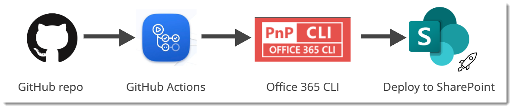

# Office 365 CLI deploy GitHub action
GitHub action to deploy an app using Office 365 CLI



This GitHub Action (created using typescript) uses [Office 365 CLI](https://pnp.github.io/office365-cli/), specifically the [spo app add](https://pnp.github.io/office365-cli/cmd/spo/app/app-add/), [spo app deploy](https://pnp.github.io/office365-cli/cmd/spo/app/app-deploy/) commands, to add and deploy.

## Usage
### Pre-requisites
Create a workflow `.yml` file in your `.github/workflows` directory. An [example workflow](#example-workflow---office-365-cli-deploy) is available below. For more information, reference the GitHub Help Documentation for [Creating a workflow file](https://help.github.com/en/articles/configuring-a-workflow#creating-a-workflow-file).

## Dependencies on other GitHub Actions

- [Office 365 CLI Login](https://github.com/pnp/action-cli-login) – **Required** . This action is dependant on `action-cli-login`. So in the workflow we need to run  `action-cli-login` before using this action.

#### Optional requirement
Since `action-cli-login` requires user name and password which are sensitive pieces of information, it would be ideal to store them securely. We can achieve this in a GitHub repo by using [secrets](https://help.github.com/en/actions/automating-your-workflow-with-github-actions/creating-and-using-encrypted-secrets). So, click on `settings` tab in your repo and add 2 new secrets:
- `adminUsername` - store the admin user name in this (e.g. user@contoso.onmicrosoft.com)
- `adminPassword` - store the password of that user in this.
These secrets are encrypted and can only be used by GitHub actions.

### Inputs
- `APP_FILE_PATH` : **Required** Relative path of the app in your repo
- `SCOPE` : Scope of the app catalog: `tenant|sitecollection`. Default is `tenant`
- `SITE_COLLECTION_URL` : The URL of the site collection where the solution package will be added. Required if scope is set to `sitecollection`
- `SKIP_FEATURE_DEPLOYMENT` : `true|false` If the app supports tenant-wide deployment, deploy it to the whole tenant. Default is `false`
- `OVERWRITE` : `true|false` Set to overwrite the existing package file. Default is `false`

### Output
- `APP_ID` : The id of the app that gets deployed

### Example workflow - Office 365 CLI Deploy
On every `push` build the code, then login to Office 365 and then start deploying.

```yaml
name: SPFx CICD with O365 CLI

on: [push]

jobs:
  build:
    ##
    ## Build code omitted
    ##
        
  deploy:
    needs: build
    runs-on: ubuntu-latest
    strategy:
      matrix:
        node-version: [10.x]
    
    steps:
    
    ##
    ## Code to get the package omitted
    ##

    # Office 365 cli login action
    - name: Login to tenant
      uses: pnp/action-cli-login@v1.0.1
      with:
        ADMIN_USERNAME:  ${{ secrets.adminUsername }}
        ADMIN_PASSWORD:  ${{ secrets.adminPassword }}
    
    # Office 365 cli deploy app action
    # Use either option 1 or option 2
    
    # Option 1 - Deploy app at tenant level
    - name: Option 1 - Deploy app to tenant
      id: o365clideploy # optional - use if output needs to be used
      uses: pnp/action-cli-deploy@v1.0.1
      with:
        APP_FILE_PATH: sharepoint/solution/spfx-o365-cli-action.sppkg
        SKIP_FEATURE_DEPLOYMENT: true
        OVERWRITE: true
    # Option 1 - ends
     
    # Option 2 - Deploy app to a site collection
    - name: Option 2 - Deploy app to a site collection
      uses: pnp/action-cli-deploy@v1.0.1
      with:
        APP_FILE_PATH: sharepoint/solution/spfx-o365-cli-action.sppkg
        SCOPE: sitecollection
        SITE_COLLECTION_URL: https://contoso.sharepoint.com/sites/teamsite
    # Option 2 - ends

    # Print the id of the app
    - name: Get the id of the app deployed
      run: echo "The id of the app deployed is ${{ steps.o365clideploy.outputs.APP_ID }}"
```


#### Self-hosted runners
If self-hosted runners are used for running the workflow, then please make sure that they have `PowerShell` or `bash` installed on them. 

## Release notes

### v1.0.0
- Added inital 'Office 365 CLI deploy' GitHub action solving #2

### v1.0.1
- Added required code solving #4